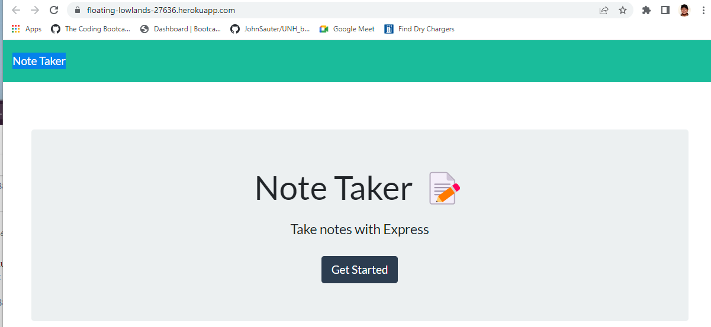

# UNH_Bootcamp-11-Note Taker

## Description

write and save notes

## Table of Contents

- [Installation](#installation)
- [Usage](#usage)
- [License](#license)

## Installation

- git clone https://github.com/JohnSauter/UNH_bootcamp-11-Note_Taker
- cd UNH_bootcamp-11-Note_Taker
- npm install

## Usage

- node server.js
- open a browser to http://localhost:3001 

Alternatively, open a browser to https://floating-lowlands-27636.herokuapp.com/

## License

GNU AGPLv3

## Features

When run locally, notes are remembered across browser sessions.cd 

## Screenshot

## Heroku deployment

https://floating-lowlands-27636.herokuapp.com/

## Questions

If you have any questions, contact me.
My e-mail address is John_Sauter@systemeyescomputerstore.com.
My github user name is JohnSauter.  See my profile at
https://github.com/JohnSauter.

